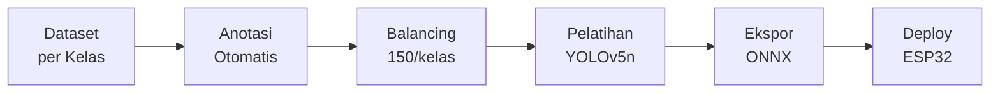
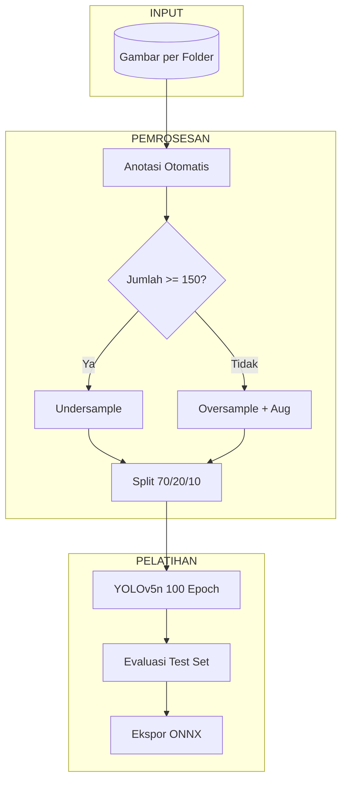
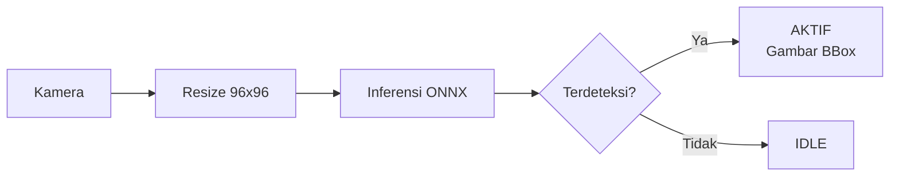
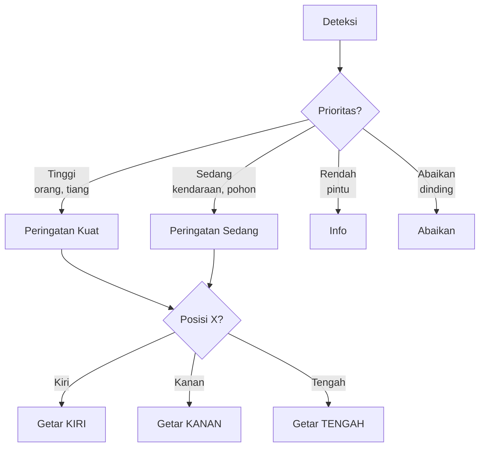

# Deteksi Objek Tongkat Pintar - ESP32-CAM

Sistem deteksi objek berbasis **YOLOv5n** untuk ESP32-CAM, dirancang sebagai alat bantu navigasi bagi penyandang tunanetra.


---

## Fitur

- **Deteksi 6 Kelas**: dinding, kendaraan_parkir (motor/mobil), orang, pintu, pohon, tiang
- **Deteksi Realtime**: ~30 FPS di PC, ~5 FPS di ESP32
- **Anotasi Otomatis**: Anotasi otomatis berdasarkan struktur folder
- **Penyeimbangan Dataset**: 150 gambar/kelas dengan augmentasi
- **Ekspor ONNX**: Model yang dioptimalkan ~10MB untuk deployment di perangkat embedded

---

## Teknologi yang Digunakan

### 🖥️ Hardware
- **ESP32-CAM**: Mikrokontroler utama untuk deployment dan inferensi (AI-on-Edge).
- **PC / GPU**: Digunakan untuk pelatihan model dan pemrosesan dataset (disarankan menggunakan GPU NVIDIA agar lebih cepat).
- **Modul Kamera**: OV2640 (modul standar ESP32-CAM).

### 🧠 AI & Machine Learning
- **YOLOv5n (Ultralytics)**: Versi nano dari arsitektur YOLOv5, dioptimalkan untuk kecepatan dan sumber daya rendah.
- **PyTorch**: Framework deep learning yang digunakan sebagai backend untuk pelatihan model.
- **ONNX (Open Neural Network Exchange)**: Format untuk interoperabilitas dan deployment model ke perangkat edge.

### 🛠️ Software & Libraries
- **Python 3.10+**: Bahasa pemrograman utama untuk skripting dan pelatihan.
- **OpenCV (cv2)**: Pemrosesan citra, resizing, dan visualisasi realtime.
- **NumPy & Pandas**: Manipulasi data dan pengelolaan dataset.
- **Matplotlib & Seaborn**: Visualisasi distribusi dataset dan metrik pelatihan.
- **Jupyter Notebook**: Lingkungan interaktif untuk alur kerja pelatihan.
- **Git**: Sistem kontrol versi.

---

## Alur Pipeline



---

## Detail Alur Pelatihan



---

## Alur Deteksi Realtime



---

## Sistem Umpan Balik (Tongkat Pintar)



---

## Struktur Folder

```
my_dataset/
├── dataset/                    # Gambar mentah per kelas
│   ├── dinding/
│   ├── kendaraan_parkir/
│   ├── orang/
│   ├── pintu/
│   ├── pohon/
│   └── tiang/
├── model_training/
│   ├── train_yolo.ipynb       # Notebook pelatihan
│   ├── train_yolo.py          # Script pelatihan
│   └── balance_dataset.py     # Pemrosesan dataset
├── testing_app/
│   └── test_yolo_realtime.py  # Script testing webcam
└── yolo_output/
    └── yolo_training/weights/best.onnx
```

---

## Cara Penggunaan

### Alur Pelatihan
```bash
# Melalui Notebook (disarankan)
jupyter notebook model_training/train_yolo.ipynb

# Melalui Script Python
python model_training/balance_dataset.py
python model_training/train_yolo.py
```

### Testing Realtime
```bash
python testing_app/test_yolo_realtime.py
```

**Kontrol:**
- `Q` = Keluar
- `D` = Toggle deteksi dinding

---

## Performa

| Metrik | Nilai |
|--------|-------|
| mAP50 | **93.4%** |
| mAP50-95 | 89.4% |
| Presisi | > 95% |
| Recall | > 90% |
| Ukuran Model | ~10 MB |
| Ukuran Input | 96×96 |