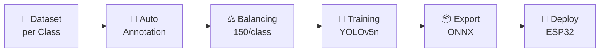
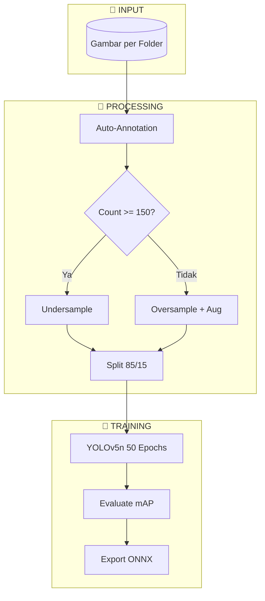
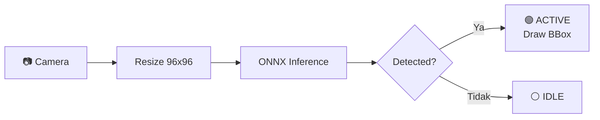
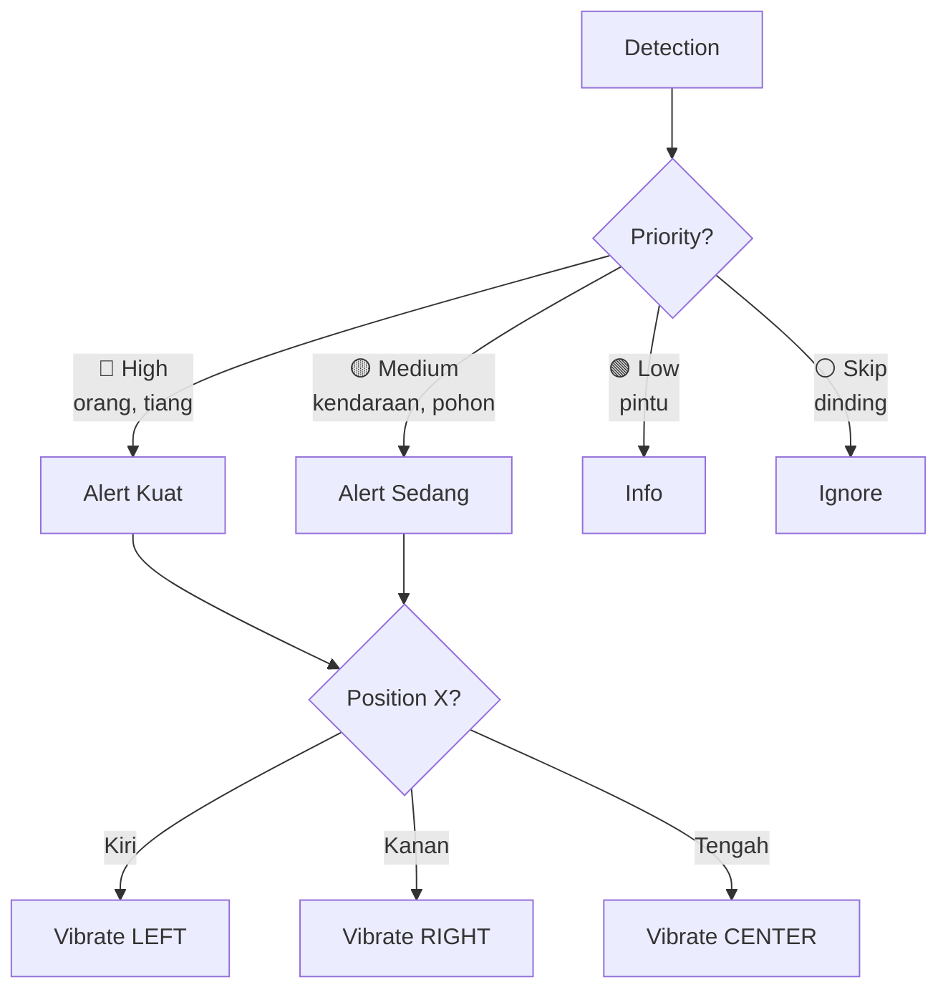

# 🦯 Smart Cane Object Detection - ESP32-CAM

Sistem deteksi objek berbasis **YOLOv5n** untuk ESP32-CAM sebagai alat bantu navigasi tunanetra.


---

## 📋 Fitur

- ✅ **6 Class Detection**: dinding, kendaraan_parkir, orang, pintu, pohon, tiang
- ✅ **Realtime Detection**: ~30 FPS pada PC, ~5 FPS pada ESP32
- ✅ **Auto-Annotation**: Anotasi otomatis dari struktur folder
- ✅ **Dataset Balancing**: 150 gambar/class dengan augmentasi
- ✅ **ONNX Export**: Model ~10MB untuk embedded deployment

---

## 🛠️ Tech Stack

| Komponen | Teknologi |
|----------|-----------|
| Training | Ultralytics YOLO, PyTorch |
| Inference | OpenCV DNN, ONNX |
| Target | ESP32-CAM |
| Language | Python 3.10+ |

---

## 📊 Pipeline Flow



---

## 📊 Training Flow Detail



---

## 📊 Realtime Detection Flow



---

## 📊 Feedback System (Tongkat)



---

## 📁 Struktur Folder

```
my_dataset/
├── dataset/                    # Gambar per class
│   ├── dinding/
│   ├── kendaraan_parkir/
│   ├── orang/
│   ├── pintu/
│   ├── pohon/
│   └── tiang/
├── model_training/
│   ├── train_yolo.ipynb       # Notebook training
│   ├── train_yolo.py
│   └── balance_dataset.py
├── testing_app/
│   └── test_yolo_realtime.py  # Webcam testing
└── yolo_output/
    └── yolo_training/weights/best.onnx
```

---

## 🚀 Cara Menjalankan

### Training
```bash
# Via Notebook (recommended)
jupyter notebook model_training/train_yolo.ipynb

# Via Python
python model_training/balance_dataset.py
python model_training/train_yolo.py
```

### Testing Realtime
```bash
python testing_app/test_yolo_realtime.py
```

**Kontrol:**
- `Q` = Quit
- `D` = Toggle deteksi dinding

---

## 📈 Performance

| Metric | Value |
|--------|-------|
| mAP50 | **93.4%** |
| mAP50-95 | 89.4% |
| Precision | 95%+ |
| Recall | 90%+ |
| Model Size | ~10 MB |
| Input Size | 96×96 |