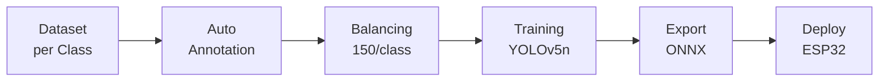
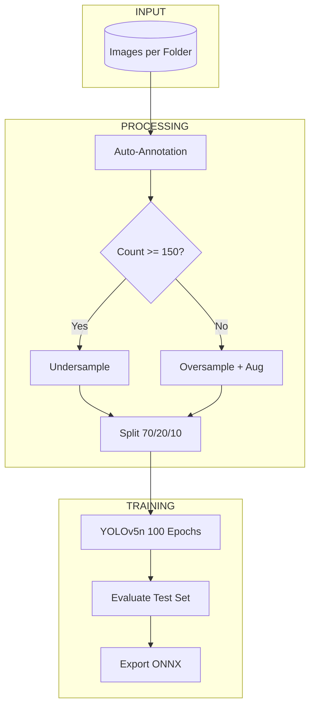
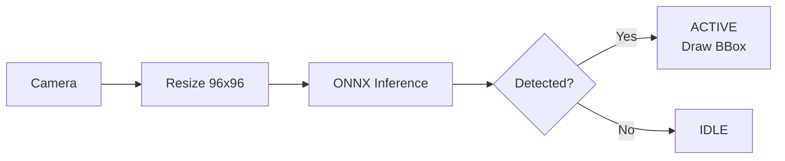
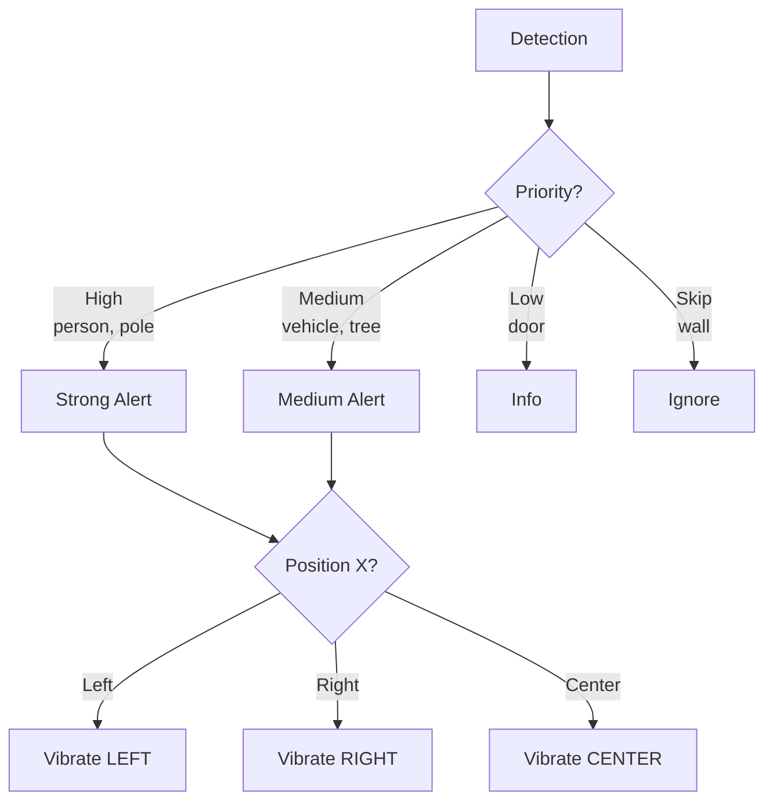

# Smart Cane Object Detection - ESP32-CAM

Object detection system based on **YOLOv5n** for ESP32-CAM, designed as a navigation aid for the visually impaired.


---

## Features

- **6 Class Detection**: dinding (wall), kendaraan_parkir (parked vehicle), orang (person), pintu (door), pohon (tree), tiang (pole)
- **Realtime Detection**: ~30 FPS on PC, ~5 FPS on ESP32
- **Auto-Annotation**: Automatic annotation from folder structure
- **Dataset Balancing**: 150 images/class with augmentation
- **ONNX Export**: Optimized ~10MB model for embedded deployment

---

## Tech Stack

### 🖥️ Hardware
- **ESP32-CAM**: The main microcontroller for deployment and inference (AI-on-Edge).
- **PC / GPU**: Used for model training and dataset processing (NVIDIA GPU recommended for faster training).
- **Camera Module**: OV2640 (standard ESP32-CAM module).

### 🧠 AI & Machine Learning
- **YOLOv5n (Ultralytics)**: Nano version of YOLOv5 architecture, optimized for speed and low resources.
- **PyTorch**: The deep learning framework backend used for training the model.
- **ONNX (Open Neural Network Exchange)**: Format used for interoperability and deploying the model to edge devices.

### 🛠️ Software & Libraries
- **Python 3.10+**: Core programming language for training and data scripts.
- **OpenCV (cv2)**: Image processing, resizing, and real-time visualization.
- **NumPy & Pandas**: Data manipulation and dataset handling.
- **Matplotlib & Seaborn**: Visualization of dataset distribution and training metrics.
- **Jupyter Notebook**: Interactive environment for training workflow.
- **Git**: Version control system.

---

## Pipeline Flow



---

## Training Flow Detail



---

## Realtime Detection Flow



---

## Feedback System (Smart Cane)



---

## Folder Structure

```
my_dataset/
├── dataset/                    # Raw images per class
│   ├── dinding/
│   ├── kendaraan_parkir/
│   ├── orang/
│   ├── pintu/
│   ├── pohon/
│   └── tiang/
├── model_training/
│   ├── train_yolo.ipynb       # Training notebook
│   ├── train_yolo.py          # Training script
│   └── balance_dataset.py     # Dataset processing
├── testing_app/
│   └── test_yolo_realtime.py  # Webcam testing script
└── yolo_output/
    └── yolo_training/weights/best.onnx
```

---

## Usage

### Training Workflow
```bash
# Via Notebook (recommended)
jupyter notebook model_training/train_yolo.ipynb

# Via Python Scripts
python model_training/balance_dataset.py
python model_training/train_yolo.py
```

### Realtime Testing
```bash
python testing_app/test_yolo_realtime.py
```

**Controls:**
- `Q` = Quit
- `D` = Toggle wall detection

---

## Performance

| Metric | Value |
|--------|-------|
| mAP50 | **93.4%** |
| mAP50-95 | 89.4% |
| Precision | > 95% |
| Recall | > 90% |
| Model Size | ~10 MB |
| Input Size | 96×96 |